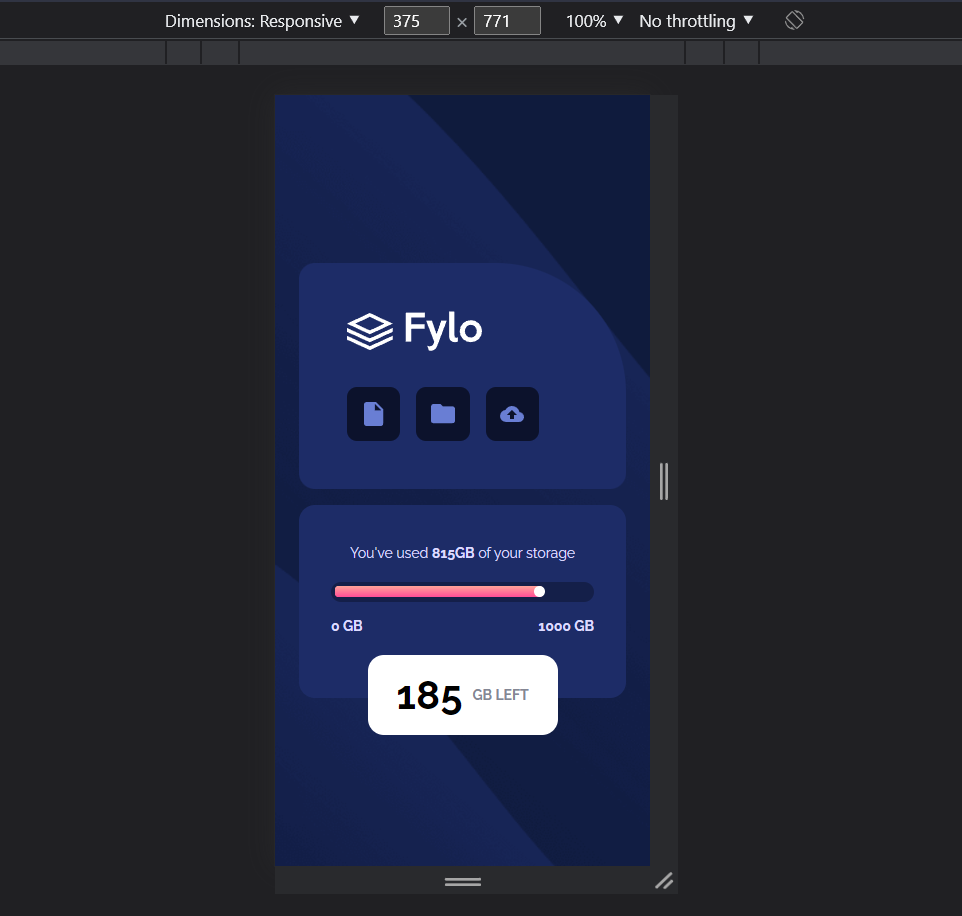

# Frontend Mentor - Fylo data storage component solution

This is a solution to the [Fylo data storage component challenge on Frontend Mentor](https://www.frontendmentor.io/challenges/fylo-data-storage-component-1dZPRbV5n). Frontend Mentor challenges help you improve your coding skills by building realistic projects. 

## Table of contents

- [Overview](#overview)
  - [The challenge](#the-challenge)
  - [Screenshot](#screenshot)
  - [Links](#links)
- [My process](#my-process)
  - [Built with](#built-with)
  - [What I learned](#what-i-learned)
  - [Useful resources](#useful-resources)
- [Author](#author)

## Overview

### The challenge

Users should be able to:

- View the optimal layout for the site depending on their device's screen size

### Screenshot




### Links

- Solution URL: [Solution](https://www.frontendmentor.io/solutions/html-sass-js-data-storage-component-9A8gC_oxvU)
- Live Site URL: [Live](https://loniewski02.github.io/FM-data-storage-component/)

## My process

### Built with

- Semantic HTML5 markup
- SASS
- Flexbox
- Mobile-first workflow
- JavaScript

**Note: These are just examples. Delete this note and replace the list above with your own choices**

### What I learned

I learned how to style radio type input.
Well, maybe I haven't learned yet, but there is definitely something left in my head :)

```css
input[type='range'] {
	-webkit-appearance: none;
	width: 100%;
	height: 100%;
	background: transparent;
	border: 1px solid transparent;
	border-radius: 1rem;
	background-image: linear-gradient($gradient);
	background-size: 81% 100%;
	background-repeat: no-repeat;
	cursor: pointer;     

   	&::-webkit-slider-thumb {
		-webkit-appearance: none;
		height: 1.1rem;
		width: 1.1rem;
		border-radius: 50%;
		background: #fff;
		cursor: ew-resize;
	}
	
	&::-webkit-slider-runnable-track {
		-webkit-appearance: none;
		box-shadow: none;
		border: none;
		background: transparent;
		border-radius: 1rem;
		width: auto;
	}
}
```

### Continued development

### Useful resources

- [css-tricks.com](https://css-tricks.com/styling-cross-browser-compatible-range-inputs-css/) - This helped me with the styling of the input radio

## Author

- Frontend Mentor - [@Loniewski02](https://www.frontendmentor.io/profile/Loniewski02)
